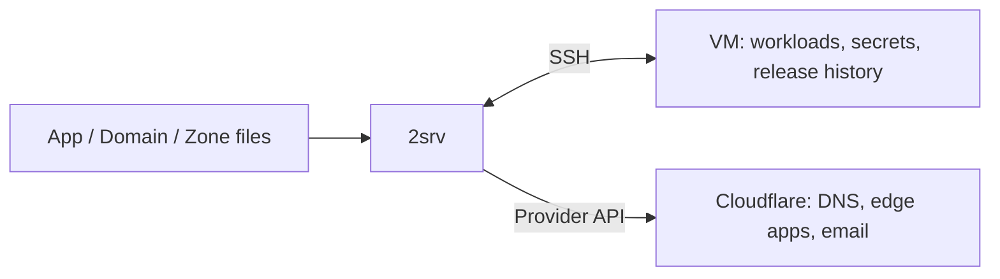

# 2server

English · [Tiếng Việt](README.vi.md)

Deploy and operate apps on infrastructure you own. **A 2found product.**

One App file in your repo. One command to release it:

```sh
2srv deploy -f api/2server/deploy.yaml --apply
```

2server manages Docker, Caddy and Cloudflare over SSH. HTTP apps get readiness-gated
blue/green releases and traffic rollback. Secrets and deployment history stay on
your VM; the CLI needs no resident control plane.

[Quick start](#quick-start) · [Commands](#everyday-commands) ·
[For agents](#for-agents) · [Docs](https://2found.dev/docs/2server/) ·
[Website](https://2found.dev/tools/2server/) ·
[GitHub](https://github.com/2found/2server)

## Install

Requires **Bun >= 1.3** and **Node >= 20**:

```sh
npm install -g @2server/cli
2srv help
```

`2srv` is the preferred command; `2server` is a compatibility alias. Older npm
releases may expose only `2server`; use that command until upgrading to a release
with `2srv`. The npm package remains `@2server/cli`.

Terraform is needed for provisioning, `gcloud` for GCP IAP and `age` for encrypted
control backups. Local Docker is needed when building images.

## Quick start

Run from your application repo. Have a pushed container image and a Debian 12/13
or Ubuntu 22.04/24.04 VM with Python 3, key-based SSH, a trusted host key and
passwordless sudo. Registry pulls must work for root on the VM.

### 1. Connect or bootstrap

**Already managed by 2server:** connect to its published state.

```sh
2srv connect --ssh ubuntu@vm.example --identity ~/.ssh/server_key
```

**First setup:** generate an empty server manifest, edit its SSH settings, then
bootstrap. Keep `*.local.json` out of Git.

```sh
2srv init server my-server -o server.local.json
# Edit server.local.json: set the real SSH host/user or GCP IAP settings.
2srv server bootstrap -f server.local.json --apply
```

Bootstrap installs Docker/Caddy, publishes initial VM state and saves the private,
ignored `.2server/connection.yaml`. It requires an empty server manifest and no
published 2server state. For GCP IAP use structured SSH settings; for a new cloud VM,
follow [provisioning](docs/operator-guide.md#provisioning) first.

### 2. Define the app

```sh
2srv init app api -o api/2server/deploy.yaml
```

Edit `spec.image`, `port`, `healthPath`, `memoryMb` and `cpus` to match your app.
The generated file includes a placeholder domain: set its real zone/hostname or
remove `domains` for an internal app. Commit the App file.

For public domains, the zone must already use Cloudflare nameservers. Supply a
scoped `CLOUDFLARE_API_TOKEN` in a private file using bootstrap's
`--env-file secrets.env`, or update the connected VM with
`2srv server env --env-file secrets.env --apply`.
See [create a Cloudflare token](docs/cloudflare-tokens.md) for Account/Zone
permissions and resource scope, and [domain ownership](docs/operator-guide.md#cloudflare-access-and-ownership).

### 3. Validate, preview, release

```sh
2srv validate -f api/2server/deploy.yaml
2srv plan -f api/2server/deploy.yaml
2srv deploy -f api/2server/deploy.yaml --apply
2srv app api get
```

`validate` is offline. `plan` inspects the VM, registry and declared domains; it
may pull image layers, but does not roll out apps, run migrations or prove write
permissions. `deploy --apply` resolves the image digest, waits for readiness,
switches traffic, then reconciles domains and verifies public HTTPS.

Every release uses the same command. Add `--image repository@sha256:…` to deploy
the digest produced by your build. A domain failure can follow a healthy app
rollout; inspect the reported state before retrying.

## Everyday commands

| Work | Command |
| --- | --- |
| List apps | `2srv app` |
| Inspect / read logs | `2srv app api get` / `2srv app api logs` |
| Roll back traffic | `2srv app api rollback --apply` |
| Discover installed capabilities | `2srv app api help` |
| Set app secrets from a private file | `2srv secret set --app api --env-file /private/api.env --apply` |
| Back up control state | `2srv server backup --output server.age --recipient-file recipients.txt` |

Declare app secrets in `spec.secrets` with `provider: vm`; values stay on the VM
and take effect on redeploy. Use `spec.preDeploy` for migrations and
`spec.preDeploy.secrets` for a separate migration credential.
[App configuration](docs/source-config.md) is the complete field reference.

## Add services with templates

Extensions are named apps, with the same file and release workflow:

```sh
2srv init app orders-db --template postgres -o platform/orders-db.yaml
# Review the generated settings and fill its declared secrets privately.
2srv secret set --app orders-db --env-file /private/orders-db.env --apply
2srv plan -f platform/orders-db.yaml
2srv deploy -f platform/orders-db.yaml --apply
2srv app orders-db help
```

| Templates | Runs on |
| --- | --- |
| `postgres`, `redis`, `nats`, `monitoring`, `image-proxy` | Your VM |
| `url-shortener` | Cloudflare Worker + D1 |
| `email-routing` | Cloudflare inbound email forwarding |

Each instance has its own secrets and data. Stateful apps update in place;
PostgreSQL backups need explicit configuration. External templates use their
provider directly; email forwarding provides neither a mailbox nor outbound SMTP.
See [template configuration](docs/source-config.md#apps-from-templates),
[PostgreSQL recovery](docs/postgres.md) and [email routing](docs/email-routing.md).

## For agents

Install the [2server skill](skills/2server/SKILL.md) through the repository
marketplace in Claude Code or Codex. The plugin uses your installed `2srv` CLI;
it does not need a retained source checkout. See [agent installation](docs/agent-plugins.md)
for commands, prerequisites, local testing and the separate public-directory
submission process. Start code work with [AGENTS.md](AGENTS.md) and
[CLI architecture](docs/ARCHITECT-CLI.md).

For operations, identify the target VM/environment and reviewed App file, then
run `validate` and `plan`. Use `app NAME help` to discover installed-template
commands. Read only the [task-specific reference](docs/README.md#operate) needed
for the operation; examples are templates, not deployment targets. Apply within
the user's authorized scope and report observed health and any partial failure.

```text
Use $2server:2server to inspect api/2server/deploy.yaml and the current connection.
Validate and plan the release. Report the target, proposed changes and any
missing credentials. This task is a preview only.
```

Source files own desired configuration; the VM owns secrets and applied state:



## Failure and recovery

- **Missing connection:** use `connect` for an already published VM; bootstrap
  only a fresh server. Connected commands never fall back to local `.env` secrets.
- **Missing secret / Cloudflare 401 or 403:** update the VM-owned credential and
  check its zone/account scope. [Operator guide](docs/operator-guide.md).
- **Failed readiness:** inspect app logs and the declared probe. Traffic rollback
  restores a recorded healthy generation; it cannot reverse a database migration.
- **Interrupted operation:** inspect state and [locks](docs/locking.md) before
  retrying. SSH loss does not prove remote work stopped.

One VM remains one failure domain. Budget for both HTTP app generations during
rollout. Root/Docker administrators can read runtime credentials. Encrypted control
backups cover config, secrets and certificates; volumes, database data, Terraform
state and the age identity need separate recovery plans.
[Reliability](docs/reliability.md) · [Control recovery](docs/control-state.md).

## Develop

```sh
bun install --frozen-lockfile
bun src/cli.ts help
bun run check
node scripts/check-docs.mjs
```

Use `bun src/cli.ts` in place of `2srv`. Before release, run
`bun run release:check` to verify the packed and installed artifact.
[Development](docs/development.md) · [Release runbook](docs/release.md) ·
[Changelog](CHANGELOG.md) · [Branding](BRANDING.md).

License: **UNLICENSED**. Public distribution does not grant an open-source license.
