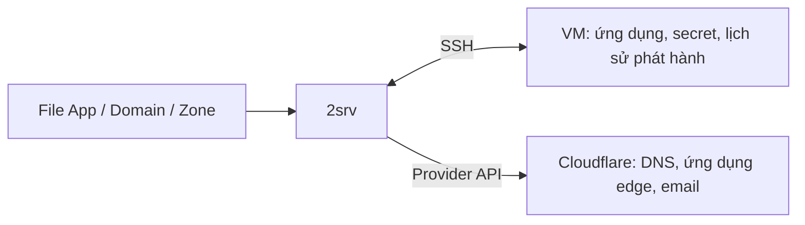

# 2server

[English](README.md) · Tiếng Việt

Deploy và vận hành ứng dụng trên hạ tầng của bạn. **A 2found product.**

Một file App trong repo. Một lệnh để phát hành:

```sh
2srv deploy -f api/2server/deploy.yaml --apply
```

2server quản lý Docker, Caddy và Cloudflare qua SSH. Ứng dụng HTTP được phát hành
blue/green, chỉ chuyển traffic khi phiên bản mới sẵn sàng và có thể rollback.
Secret và lịch sử triển khai nằm trên VM; CLI không cần một control plane chạy thường trực.

[Bắt đầu nhanh](#bắt-đầu-nhanh) · [Lệnh thường dùng](#lệnh-thường-dùng) ·
[Dành cho agent](#dành-cho-agent) · [Tài liệu](https://2found.dev/vi/docs/2server/) ·
[Website](https://2found.dev/vi/tools/2server/) ·
[GitHub](https://github.com/2found/2server)

## Cài đặt

Yêu cầu **Bun >= 1.3** và **Node >= 20**:

```sh
npm install -g @2server/cli
2srv help
```

Ưu tiên dùng lệnh `2srv`; `2server` là alias để giữ tương thích. Các bản npm cũ
có thể chỉ cung cấp `2server`; dùng lệnh đó cho đến khi nâng cấp lên bản có
`2srv`. Tên package npm vẫn là `@2server/cli`.

Cần Terraform khi provision VM, `gcloud` khi dùng GCP IAP và `age` để mã hóa bản
sao lưu control state. Cần Docker trên máy local khi build image.

## Bắt đầu nhanh

Chạy lệnh từ repo ứng dụng. Chuẩn bị container image đã push lên registry và
VM Debian 12/13 hoặc Ubuntu 22.04/24.04 có Python 3, SSH bằng key, host key đã
xác minh và sudo không cần mật khẩu. Tài khoản root trên VM phải pull được image.

### 1. Kết nối hoặc bootstrap

**VM đã được 2server quản lý:** kết nối đến state đã được lưu trên VM.

```sh
2srv connect --ssh ubuntu@vm.example --identity ~/.ssh/server_key
```

**Thiết lập lần đầu:** tạo server manifest rỗng, chỉnh cấu hình SSH rồi bootstrap.
Không đưa `*.local.json` vào Git.

```sh
2srv init server my-server -o server.local.json
# Chỉnh server.local.json: đặt SSH host/user thực tế hoặc cấu hình GCP IAP.
2srv server bootstrap -f server.local.json --apply
```

Bootstrap cài Docker/Caddy, lưu state ban đầu trên VM và tạo file kết nối riêng tư
`.2server/connection.yaml` được Git bỏ qua. Thao tác này yêu cầu server manifest
rỗng và VM chưa có state do 2server lưu. Với GCP IAP, dùng cấu hình SSH có cấu
trúc; với VM cloud mới, làm theo [hướng dẫn provision](docs/operator-guide.md#provisioning) trước.

### 2. Khai báo ứng dụng

```sh
2srv init app api -o api/2server/deploy.yaml
```

Chỉnh `spec.image`, `port`, `healthPath`, `memoryMb` và `cpus` theo ứng dụng.
File được tạo có domain mẫu: thay bằng zone/hostname thực tế hoặc bỏ `domains`
nếu ứng dụng chỉ dùng nội bộ. Commit file App vào repo.

Với domain public, zone phải dùng nameserver của Cloudflare. Cung cấp
`CLOUDFLARE_API_TOKEN` có phạm vi quyền phù hợp qua file riêng tư, dùng tùy chọn
`--env-file secrets.env` khi bootstrap; hoặc cập nhật VM đã kết nối bằng
`2srv server env --env-file secrets.env --apply`.
Xem [tạo token Cloudflare](docs/cloudflare-tokens.md) để chọn đủ quyền Account/Zone
và phạm vi tài nguyên, cùng [domain ownership](docs/operator-guide.md#cloudflare-access-and-ownership).

### 3. Kiểm tra, xem kế hoạch, phát hành

```sh
2srv validate -f api/2server/deploy.yaml
2srv plan -f api/2server/deploy.yaml
2srv deploy -f api/2server/deploy.yaml --apply
2srv app api get
```

`validate` chạy offline. `plan` kiểm tra VM, registry và domain đã khai báo;
có thể pull các layer của image, nhưng không triển khai ứng dụng, chạy migration
hay chứng minh quyền ghi. `deploy --apply` xác định image digest, chờ readiness,
chuyển traffic rồi đồng bộ domain và kiểm tra HTTPS public.

Mỗi lần phát hành dùng cùng lệnh này. Thêm `--image repository@sha256:…` để deploy
digest từ lần build của bạn. Domain có thể gặp lỗi sau khi ứng dụng đã triển khai
và hoạt động tốt; kiểm tra state được báo trước khi thử lại.

## Lệnh thường dùng

| Công việc | Lệnh |
| --- | --- |
| Liệt kê ứng dụng | `2srv app` |
| Kiểm tra / đọc log | `2srv app api get` / `2srv app api logs` |
| Rollback traffic | `2srv app api rollback --apply` |
| Xem các khả năng đã cài | `2srv app api help` |
| Đặt secret ứng dụng từ file riêng tư | `2srv secret set --app api --env-file /private/api.env --apply` |
| Sao lưu control state | `2srv server backup --output server.age --recipient-file recipients.txt` |

Khai báo secret ứng dụng trong `spec.secrets` với `provider: vm`; giá trị nằm
trên VM và có hiệu lực khi deploy lại. Dùng `spec.preDeploy` cho migration và
`spec.preDeploy.secrets` để cấp credential riêng cho tác vụ migration.
[Tài liệu cấu hình App](docs/source-config.md) mô tả đầy đủ các trường.

## Thêm dịch vụ bằng template

Extension là ứng dụng có tên riêng, dùng cùng workflow khai báo và phát hành:

```sh
2srv init app orders-db --template postgres -o platform/orders-db.yaml
# Kiểm tra cấu hình được tạo và chuẩn bị riêng các secret đã khai báo.
2srv secret set --app orders-db --env-file /private/orders-db.env --apply
2srv plan -f platform/orders-db.yaml
2srv deploy -f platform/orders-db.yaml --apply
2srv app orders-db help
```

| Template | Chạy trên |
| --- | --- |
| `postgres`, `redis`, `nats`, `monitoring`, `image-proxy` | VM của bạn |
| `url-shortener` | Cloudflare Worker + D1 |
| `email-routing` | Cloudflare, chuyển tiếp email đến |

Mỗi instance có secret và dữ liệu riêng. Ứng dụng có state được cập nhật tại chỗ;
cần cấu hình rõ ràng để sao lưu PostgreSQL. Template bên ngoài VM làm việc trực
tiếp với provider; chuyển tiếp email không cung cấp hộp thư hay SMTP gửi đi.
Xem [cấu hình template](docs/source-config.md#apps-from-templates),
[khôi phục PostgreSQL](docs/postgres.md) và [email routing](docs/email-routing.md).

## Dành cho agent

Cài [skill 2server](skills/2server/SKILL.md) qua marketplace của repository trong
Claude Code hoặc Codex. Plugin dùng CLI `2srv` đã cài trên máy, không cần giữ
source checkout. Xem [hướng dẫn cài cho agent](docs/agent-plugins.md) để lấy lệnh
cài, điều kiện chạy, cách kiểm tra local và quy trình riêng để đưa vào danh mục
chính thức.
Khi sửa code, bắt đầu với [AGENTS.md](AGENTS.md) và [kiến trúc CLI](docs/ARCHITECT-CLI.md).

Khi vận hành, xác định VM/môi trường đích và file App đã kiểm tra, rồi chạy
`validate` và `plan`. Dùng `app NAME help` để khám phá lệnh của template đã cài.
Chỉ đọc [tài liệu theo tác vụ](docs/README.md#operate) cần cho thao tác đó;
các ví dụ là mẫu, không phải deployment target. Apply trong phạm vi người dùng
đã cho phép, rồi báo tình trạng thực tế và lỗi nếu thao tác chỉ hoàn thành một phần.

```text
Dùng $2server:2server để kiểm tra api/2server/deploy.yaml và kết nối hiện tại.
Validate và lập kế hoạch phát hành. Báo target, các thay đổi dự kiến và
credential còn thiếu. Tác vụ này chỉ xem kế hoạch, chưa apply.
```

Source file quản lý cấu hình mong muốn; VM quản lý secret và state đã áp dụng:



## Xử lý lỗi và khôi phục

- **Thiếu kết nối:** dùng `connect` với VM đã có state; chỉ bootstrap server mới.
  Lệnh đã kết nối không lấy secret từ `.env` local để thay thế.
- **Thiếu secret / Cloudflare trả 401 hoặc 403:** cập nhật credential trên VM và
  kiểm tra phạm vi zone/account. [Hướng dẫn vận hành](docs/operator-guide.md).
- **Readiness thất bại:** kiểm tra log và probe đã khai báo. Rollback traffic
  khôi phục phiên bản đã được ghi nhận là hoạt động tốt; không hoàn tác migration DB.
- **Thao tác bị gián đoạn:** kiểm tra state và [lock](docs/locking.md) trước khi
  thử lại. Mất SSH không chứng minh tác vụ trên VM đã dừng.

Một VM vẫn là một miền lỗi: VM ngừng hoạt động có thể ảnh hưởng toàn bộ dịch vụ.
Dự trù tài nguyên cho cả hai phiên bản ứng dụng HTTP khi rollout. Quản trị viên
root/Docker có thể đọc credential runtime. Bản sao lưu control state được mã hóa
chứa config, secret và certificate; volume, dữ liệu DB, Terraform state và age
identity cần kế hoạch khôi phục riêng.
[Độ tin cậy](docs/reliability.md) · [Khôi phục control state](docs/control-state.md).

## Phát triển

```sh
bun install --frozen-lockfile
bun src/cli.ts help
bun run check
node scripts/check-docs.mjs
```

Dùng `bun src/cli.ts` thay cho `2srv`. Trước khi phát hành, chạy
`bun run release:check` để kiểm tra artifact đóng gói và bản cài đặt.
[Phát triển](docs/development.md) · [Quy trình phát hành](docs/release.md) ·
[Changelog](CHANGELOG.md) · [Branding](BRANDING.md).

License: **UNLICENSED**. Phân phối công khai không đồng nghĩa với cấp giấy phép nguồn mở.
